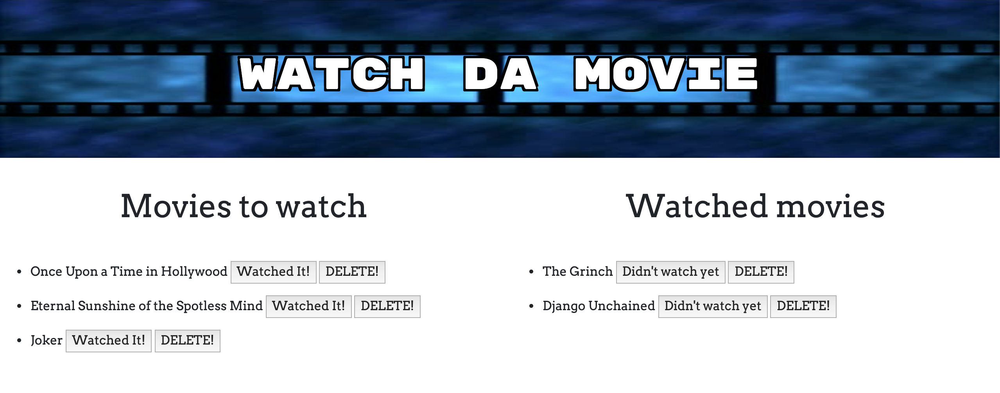

# Watch Da Movie

# Site Images

# Movie List

# Add Movie Form

Welcome to Watch Da Movie where users can add to the list of movies they want to watch and check off from that list ones that they have. Users can also delete movies from both sides and switch back from watched to wanting to watch. This is just in case you haven't watched that Tarantino film over 7 times and you simply can't get enough of it. All movies being tracked are done using mySQL and an ORM with handlebars is being utilized to handle the logic within the sites functions.

# Link to Deployed Site
[Watch Da Movie](https://infinite-hollows-74360.herokuapp.com/)

# Built With
- HTML
- Bootstrap
- CSS
- Javascript
- Node
- npm
- MySQL

# NPM's Used
- Express
- Express Handlebars
- MySQL

# Databases Used
- MySQL

